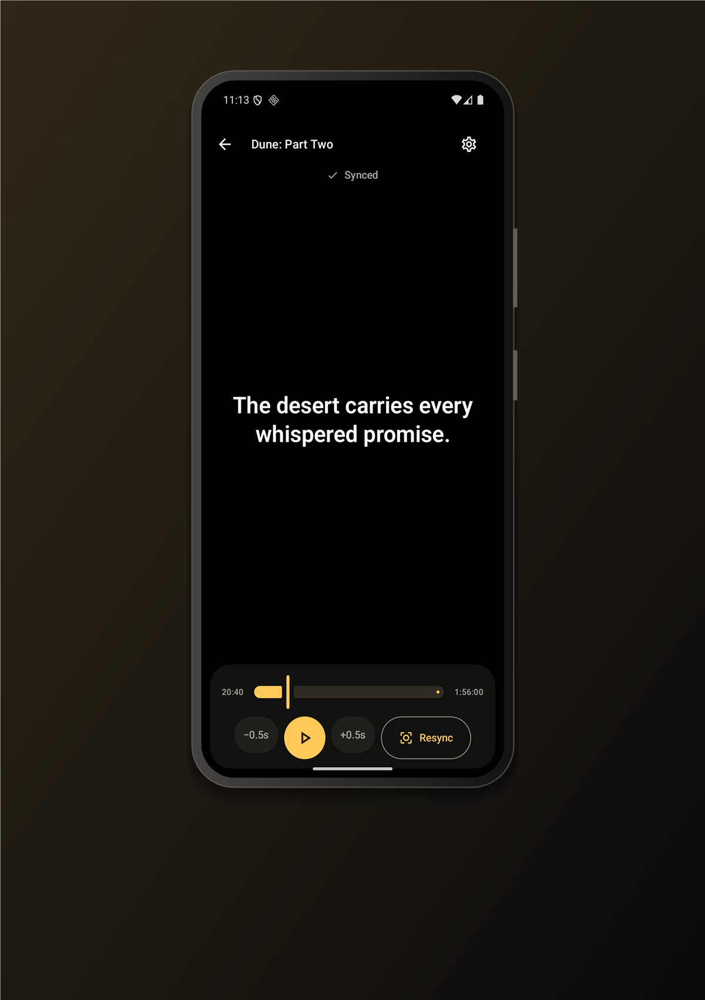
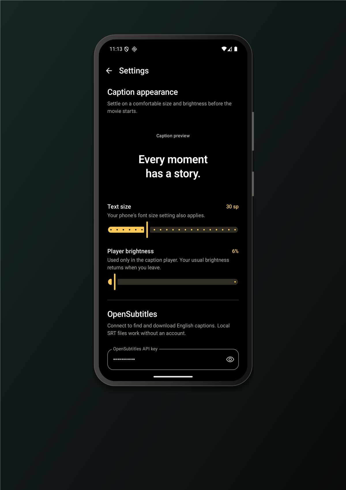
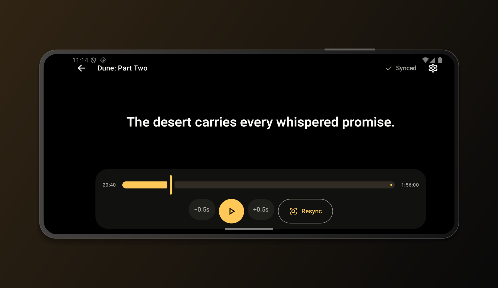

<p align="center">
  
</p>

# Kaptus

**Companion captions that can find their place in a movie or TV episode.**

Kaptus is an Android app for the moments when a movie or TV show does not have usable captions. Choose what you are watching, let Kaptus listen to a short stretch of dialogue, and it will find the matching line in the subtitle track. Once it is synchronized, the microphone turns off and the captions continue on a calm, cinema-friendly screen.

Kaptus is an early preview made with hard-of-hearing viewers in mind. It currently supports English audio and English captions on Android 13 or newer.

<p align="center">
  
  
</p>

<p align="center">
  
</p>

<p align="center"><sub>The Dune: Part Two caption shown here is illustrative and is not dialogue from the film.</sub></p>

## Download Kaptus

**[Download the latest Kaptus APK](https://github.com/desigrit/kaptus/releases/latest/download/Kaptus-preview.apk)**

This is a debug-signed preview build for testing, distributed through GitHub. The download is about 129 MB because it includes the on-device English speech model. After downloading it, open the APK on your phone and follow Android's prompt to allow installation from your browser or Files app.

See the [latest release page](https://github.com/desigrit/kaptus/releases/latest) for the version, file size, and SHA-256 checksum.

**A Google Play listing is planned.**

## Getting started

Kaptus gives you two ways to begin:

### Open an SRT file

Choose **Open SRT file** to pick a caption file from your phone or a connected cloud-storage provider. This path works without an OpenSubtitles account or an internet connection.

### Find a movie or TV show

Choose **Find a movie or TV show**, search by title, and select the correct result. For a TV show, choose the season and episode. Kaptus ranks complete English captions, prefers SDH tracks, and downloads the best match.

The first time you use search, Kaptus asks for an OpenSubtitles API key.

## Get an OpenSubtitles API key

Kaptus uses a bring-your-own-key setup. Each person connects their own OpenSubtitles account and uses their own download allowance:

1. Create an account or sign in at [OpenSubtitles.com](https://www.opensubtitles.com/).
2. Open your profile and choose **API Consumers**.
3. Create a consumer with a unique alphanumeric name, such as `KaptusPersonal`.
4. Add a short description, such as `Personal use with Kaptus`.
5. Keep **Allow anonymous downloads** selected if you want to use the API key without entering your OpenSubtitles username and password, then save the consumer.
6. Copy the generated API key.
7. In Kaptus, open **Settings**, paste the key, and tap **Save**. Account credentials are optional when anonymous downloads are enabled for your consumer.

OpenSubtitles provides more background in its [REST API getting-started guide](https://opensubtitles.stoplight.io/docs/opensubtitles-api/e3750fd63a100-getting-started).

Keep your API key private. Kaptus encrypts it with Android Keystore and keeps it on your phone. No shared API key is included in the app or this repository. Your access and download allowance remain connected to your own OpenSubtitles account.

## Watching with Kaptus

1. Start the movie or episode and open its prepared captions in Kaptus.
2. Grant microphone access and let a clear line of dialogue play.
3. Kaptus listens to overlapping six-second windows, transcribes on your phone, and searches the subtitle text for that phrase.
4. When **Synced** appears, the microphone stops and the caption clock continues on its own.
5. Tap anywhere to reveal playback controls. Use **Resync** whenever you need Kaptus to listen again.

You can pause captions, move along the timeline, adjust timing in half-second steps, change text size and brightness, or lock the screen orientation. Manual timeline changes never turn the microphone back on.

Each synchronization attempt stops after 30 seconds of detected dialogue if it cannot find a unique match. Clear, distinctive dialogue works best. Very short or repeated lines, music-heavy scenes, background conversations, and captions from a different cut can prevent a reliable match. Move closer to the movie audio, wait for a clearer line, and tap **Resync** to try again.

## Prepare before you go

Choose **Prepare for theater** while you are online to save up to three ranked caption tracks. The speech model is bundled with the app, so a prepared movie or episode can synchronize without a network connection.

For the best result, choose the exact movie and year or the correct TV episode, place the phone where it can hear the room audio clearly, and start synchronization during spoken dialogue. Alternate cuts can use different timing or dialogue, so Resync or another caption track may be needed.

## Privacy

- Speech recognition runs on the phone.
- Microphone audio stays in memory and is never saved to disk.
- Audio is never uploaded.
- The microphone stops as soon as Kaptus finds the scene.
- It starts again only for an unfinished initial search or when you tap **Resync**.
- OpenSubtitles credentials are encrypted with Android Keystore.
- Downloaded captions are stored in app-private storage.

## Build from source

Kaptus requires JDK 17, Android SDK 36, NDK `27.1.12297006`, and CMake `3.22.1`.

The build downloads pinned copies of whisper.cpp, the English Whisper model, and the Silero voice-activity model. Every download is verified with SHA-256 before it is packaged. Generated model files stay under `app/build` and are not committed.

Debug builds support `arm64-v8a` phones and `x86_64` emulators. Release builds currently target `arm64-v8a`.

```powershell
./gradlew testDebugUnitTest lintDebug assembleDebug
```

## How synchronization works

Kaptus records overlapping six-second windows while it is finding the current scene. Recognition runs in a latest-only queue, so old audio never builds up behind the current dialogue. A normalized copy of the transcript is matched against a token index built from the subtitle file. Case, punctuation, apostrophe style, formatting tags, speaker labels, and bracketed sound descriptions are ignored during matching.

When Kaptus finds a unique phrase, it uses the audio capture time to compensate for transcription delay and starts the caption clock at the estimated playback position. The original SRT text remains untouched for display.

## Current scope

- English audio and English captions
- User-selected movie or TV show, with season and episode selection
- Local SRT files or OpenSubtitles caption tracks
- Android 13 or newer
- On-device scene matching

Kaptus does not identify an unknown title from audio and does not generate captions when a subtitle track is missing.

If you try the preview, feedback about synchronization speed, timing, readability, and theater use is especially welcome.
